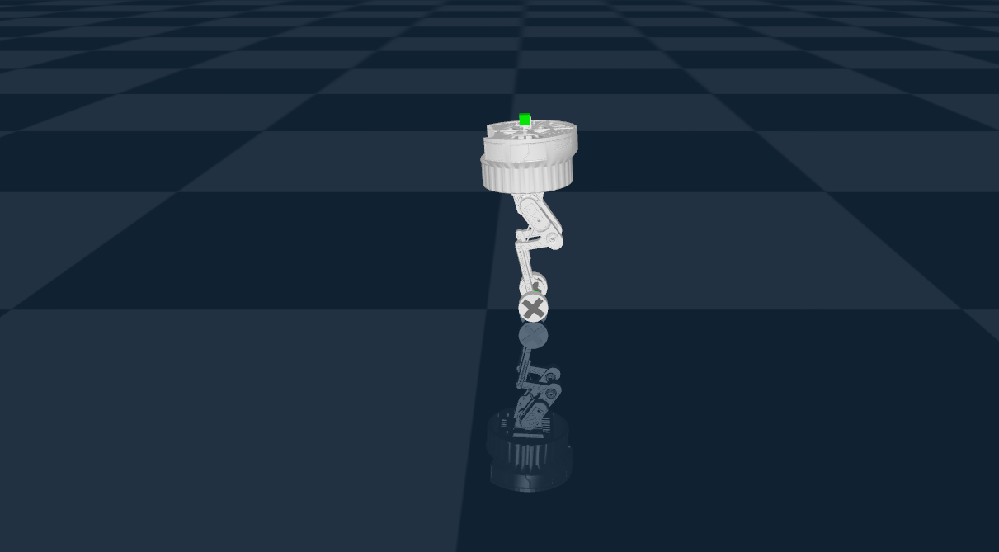
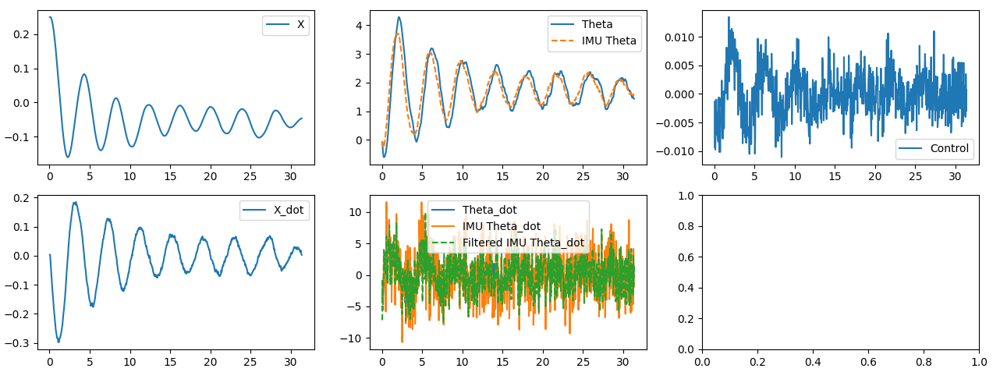

<!--  -->
# Wheeled Biped Simulation
This repo contains experiments using reinforcement learning to control a bipedal wheeled robot in simulation. Training is done using IsaacLab and the skrl library (PPO agent).

### Key features:

- Custom reward shaping for velocity tracking

- Supports sequential and parallel training

- Trainable with PPO, SAC.

- Configurations for SKRL and SB3.

- Designed to transfer policies to the real robot (bridge sim2real gap).

The real robot repo — all embedded software, motor drivers, CAN communication, and low-level control is available here:

- Most up to date embedded code [HERE](https://github.com/ojferro/NucleoFirmware)
- RTOS version of the embedded code, rougher around the edges [HERE](https://github.com/ojferro/NucleoRTOS)
- Realtime data visualization from on-board sensors (IMU, battery, motor pos/val/torque) [HERE](https://github.com/ojferro/MissionControl)

### How To's
To train:
```
python isaaclab/train_basis_skrl.py --task Basis_Env_v0 --num_envs 4096 --algorithm PPO --max_iterations 1000 --headless
```

To evaluate:
```
isaaclab/play_basis_skrl.py --task Basis_Env_v0 --num_envs 256 --checkpoint <path_to_checkpoint>
```

Still in early stages — things will break :)

## IsaacLab Simulation

See `isaaclab/` subdir for simulation configs, training and evaluation scripts.

### Requirements
- IsaacLab [link](https://github.com/isaac-sim/IsaacLab)


## MuJoCo Simulation



See `mujoco_sim/` subdir for simulation configs, training and evaluation scripts for the MuJoCo version.

This version contains Kalman and Complementary filters, LQR solvers, and a lot more.

### Logs showing Kalman Filter performance


### Tuned LQR system response
